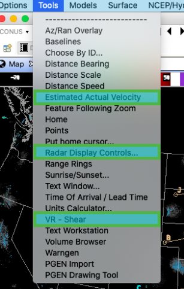
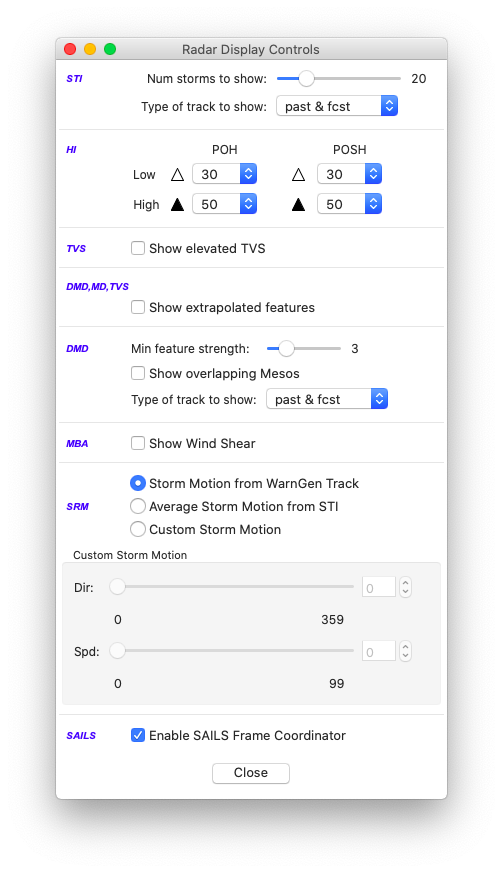

# Radar Tools

The radar tools are a subset of the tools available in CAVE. These programs are accessible though the **Tools** dropdown menu, and in individual site radar menus.

---

## Estimated Actual Velocity (EAV)

A velocity (V) display from the radar shows only the radial component of the wind, so the indicated speed depends on the direction of the wind and the azimuth (direction) from the radar. Consider, for example, a north wind. Straight north of the radar, the full speed of the wind will be seen on the V product. As one moves around to the east of the radar, the radial component gets smaller, eventually reaching zero straight east of the radar. If the wind direction is known, then the actual wind speed can be computed by dividing the observed radial speed by the cosine of the angle between the radar radial and the actual direction. The EAV tool allows you to provide that angle and use the sampling function of the display to show the actual wind speed.

---

## Radar Display Controls

The Radar Display Controls dialog box is derived from the Radar Tools submenu and provides options that control the appearance of the Storm Track Information (STI), the Hail Index (HI), the Tornado Vortex Signature (TVS), the Digital Mesocyclone Display (DMD) products, the Microburst Alert (MBA) products, the Storm Relative Motion (SRM), and the SAILS products. The Radar Display Controls dialog box options are described below.

> **Note**: Our version of CAVE may not have all the products that these options are applicable to.

The Radar Display Controls dialog box is divided into eight sections: [STI](#sti-storm-track-information), [HI](#hi-hail-index), [TVS](#tvs-tornado-vortex-signature), [DMD/MD/TVS](#dmd-md-tvs), [DMD](#dmd-digital-mesocyclone-display), [MBA](#mba-microburst-alert), [SRM](#srm-storm-relative-motion), and [SAILS](#sails-supplemental-adaptive-intra-volume-low-level-scan). Each section has the following options:

### STI (Storm Track Information)

This section has options to adjust the appearance of the STI graphic product.

* **Number of storms to show**: This slider bar lets you choose the maximum number of storms (0 to 100) you wish to display on the STI product. The default value is 20 storms.
* **Type of track to show**: This options menu allows you to choose the type of storm track that you want displayed.

### HI (Hail Index)

This portion of the Radar Display Controls dialog box contains options that alter the appearance of the HI radar graphic product. You can set the low and high algorithm thresholds of the Probability of Hail (POH) and the Probability of Severe Hail (POSH). Storms that meet the low POH threshold are indicated by small open triangles, while small solid triangles mark those that meet the high POH threshold. Similarly, large open triangles or solid triangles are plotted for the POSH low and high thresholds, respectively.

* **Low hail probability (POH)**: The storms that meet or exceed the threshold are indicated by small open triangles. The default setting is 30.
* **Low severe hail probability (POSH)**: The storms that meet or exceed the threshold are indicated by large open triangles. The default setting is 30.
* **High hail probability**: The storms that meet or exceed the threshold are indicated by small solid triangles. The default setting is 50.
* **High severe hail probability**: The storms that meet or exceed the threshold are indicated by small solid triangles. The default setting is 50.

### TVS (Tornado Vortex Signature)

There is one option in this section of the Radar Display Controls dialog box.

* **Show elevated TVS**: This toggle button lets you control the appearance of the elevated TVS radar graphic product.

### DMD, MD, TVS

There is one option in this section of the Radar Display Controls dialog box.

* **Show extrapolated features**: With this option, you can choose whether to show the time-extrapolated features using DMD, MD, or TVS.

### DMD (Digital Mesocyclone Display)

* **Minimum feature strength**:  A mesocyclone clutter filter which specifies the minimum 3D strength rank use to display a mesocyclone (default is 5).
* **Show overlapping Mesos**:  Toggles whether to show overlapping mesocyclones.
* **Type of track to show**:  This dropdown has option available for whether to display past and/or forcast tracks.

### MBA (Microburst Alert)

* **Show Wind Shear**:  This option allows you to choose whether to display wind shear associated with microburts alerts.

### SRM (Storm Relative Motion)

The first three options in the SRM section allow you to choose where you want to derive the storm motion from.

* **Storm Motion from WarnGen Track**:  Selecting this option will display the storm motion from a WarnGen Track.
* **Average Storm Motion from STI**:  Selecting this option will display the average storm motion from from the storm track information (STI).
* **Custom Storm Motion**:  Selecting this option allows you to specify a custom storm motion with the selections below.
    - **Direction**: This slider allows you to choose the direction (in degrees??) of the storm motion.
    - **Speed**:  This slider allows you to specify the speed (in mph??) of the storm motion.

### SAILS (Supplemental Adaptive Intra-Volume Low Level Scan)

* **Enable SAILS Frame Coordinator**:  
**Enabled (default)**: keyboard shortcuts change where tilting up from 0.5 degree SAILS tilt will step to the next higher tilt (similar to GR2 Analyst) and Ctrl right arrow will step to the most recent tilt available for any elevation angle.  
**Disabled**: keyboard shortcuts change where tilting up from 0.5 degree SAILS tilt will not go anywhere (old confusing behavior) and Ctrl right arrow will step to the most recent time of the current tilt.

---

## VR - Shear

This tool is used in conjunction with Doppler velocity data to calculate the velocity difference (or "shear") of the data directly under the end points. As with the Baselines, this feature comes up editable and the end points can be dragged to specific gates of velocity data. When in place, the speed difference (kts), distance between end points (nautical miles), shear (s-1), and distance from radar (Nmi) are automatically plotted next to the end points and in the upper left corner of the Main Display Pane. A positive shear value indicates cyclonic shear, while a negative value indicates anticyclonic shear. If either end point is not directly over velocity data, the phrase "no data" is reported for the shear value. This tool is also useful in determining gate-to-gate shear. Simply place the two end points directly over adjacent gates of velocity data.

* **"Snapping" VR Shear**: If you are zoomed in over an area when you load VR - Shear, and the VR - Shear Baseline does not appear, click the right mouse button to "snap" the Baseline to where the mouse cursor is located.
* **VR - Shear in 4 Panel**: You can use the VR - Shear Tool when the large display is in 4 panel
mode. The VR - Shear overlay is loaded in different colors for each panel. There are actually
four copies of the program running, and each behaves independently. This means that you can
get accurate readings in any one of the four panels — one VR - Shear panel is editable at a time. To activate, click the center mouse button on the VR - Shear legend in the desired panel and position the query line to the echoes of interest.
