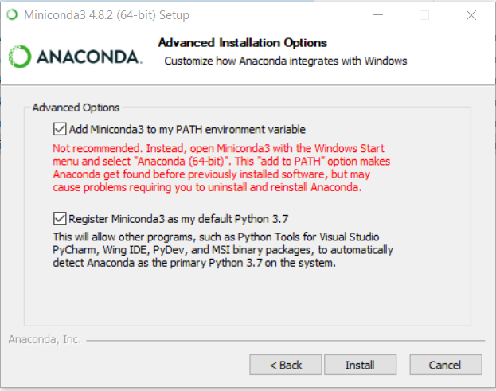
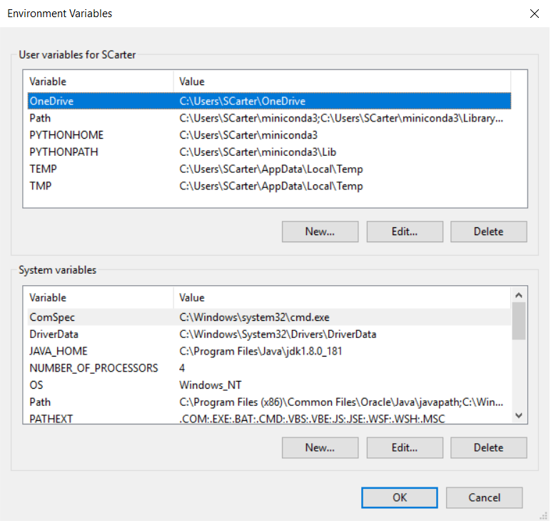

# Install CAVE

CAVE is the **C**ommon **A**WIPS **V**isualization **E**nvironment that is used for rendering and analyzing data for AWIPS.  Unidata supports CAVE to work on three platforms: [Centos (Redhat) Linux](#linux), [Windows](#windows), and [macOS](#macos).  The installer may require administrator priviledges to install and may require other system changes (environment variables, etc) as well.

---

## General Requirements

Regardless of what Operating System CAVE is running on, these general requirements are recommended in order for CAVE to perform optimally:

- Java 1.8
- OpenGL 2.0 Compatible Devices
- At least 4GB RAM
- At least 2GB Disk Space for Caching
- NVIDIA Graphics Card
- [Latest NVIDIA Driver](http://www.nvidia.com/Download/index.aspx?lang=en-us)
> Note: While other graphics cards *may* work, NVIDIA Quadro graphics card is recommended for full visualization capability

---

## Linux <i class="fa fa-linux"></i> 

### System Requirements

- 64 bit CentOS/Red Hat 7

### Download and Installation Instructions

1. Download the following installer: [**awips_install.sh** <i class="fa fa-download"></i>](https://www.unidata.ucar.edu/software/awips2/awips_install.sh)
2. In a terminal, go to the download directory 
3. Make the installer an executable by running: `chmod 755 awips_install.sh`
4. Run the installer: `sudo ./awips_install.sh --cave`
     - This will install the application in `/awips2/cave/` and set the local cache to `~/caveData/`

To run CAVE either:

- Use the terminal and type the command `cave`
- Find the application in the Linux Desktop menu: Applications > Internet > AWIPS CAVE

---

## Windows <i class="fa fa-windows"></i> 

For Windows, Unidata offers two installation options: a [**Linux Virtual Machine**](#method-1-linux-virtual-machine), or a [**Direct Windows Installation**](#method-2-direct-windows-install).

Currently, the [virtual machine (VM)](#method-1-linux-virtual-machine) is the recommended form of install for those who do not have administrative priviledges on the machine, or beginners who want a simpler installation process.  
> Note: At the moment, the VM option may not render all products in CAVE (ex. RGB composites of satellite imagery)

The [direct installation method](#method-2-direct-windows-install) is recommended for those who have administrative priviledges and a little bit of experience installing more software.

### Method 1: Linux Virtual Machine

This method is recommended for beginners, or those with less computer knowledge as it is a very simple installation, however at this time, some CAVE functionality may be missing (ex: rendering RGB satellite images).

#### System Requirements

- [VMWare Workstation Player](https://www.vmware.com/products/workstation-player/workstation-player-evaluation.html) must be installed (free software)

#### Download and Installation Instructions

1. Download the zipped file containing the virtual machine: [**unidata_cave.zip** <i class="fa fa-download"></i>](https://www.unidata.ucar.edu/downloads/awips2/unidata_cave.zip)
2. Unzip the folder by right-clicking and selecting "Extract All".  All files will be extracted into a new folder.
3. Open VMWare Player and go to **Player** > **File...** > **Open** and locate the folder that was created from the downloaded zipped file.  Select the file called **"CentOS 7 - Unidata CAVE"**.
4. Run this new VM option.  If it asks if it's been moved or copied, select **copied**.
     - There will be a user in the Linux machine named "awips" and the password is "awips"
     - The root password is "unidataAWIPS" if ever needed

Once inside the VM, to run CAVE either:

- Use the desktop icon 
- Use the terminal and type the command `cave`
- Find the application in the Linux Desktop menu: Applications > Internet > AWIPS CAVE

### Method 2: Direct Windows Install

This method is recommended for personal use and requires Administrative priviledges.  It should enable full CAVE capability, but it is a bit lengthy and might take about 20 minutes or so to complete.  

#### System Requirements

- 64-bit Miniconda3 (Python3.7 - 4.8.2)
- Python3 (comes with Miniconda installation)
- 64-bit Java JDK 1.8 (1.8_181)
- 64-bit Visual C++ Build Tools 2015 Update 3 (14.1)
- Numpy (1.15.1)
- Jep (3.8.2)
- User Variable PATH must have miniconda3 location
- User Variables PYTHONHOME and PYTHONPATH must be defined
- System Variable JAVA_HOME must be defined

#### Download and Installation Instructions

1. Download and install 64-bit [Miniconda Python3.7 version 4.8.2 for Windows](https://repo.anaconda.com/miniconda/Miniconda3-py37_4.8.2-Windows-x86_64.exe)
    - **Allow** Miniconda3 to set **PATH** and other environment variables
    - **Register** miniconda as the default python
    
2. Download and install the 64-bit [Java JDK 1.8_181](https://www.unidata.ucar.edu/downloads/awips2/jdk-8u181-windows-x64.exe) (this is necessary so Jep can install properly).
    - Select **Development Tools** as the installation options
    - Make note of where it installs on your computer (the default is C:\ProgramFiles\Java\jdk1.8.0_181)
3. Set the environment variables:
    - Access the Environment Variables window by typing "env" in the start bar, hitting enter, and clicking on the "Environment Variables..." button at the bottom of the "System Properties" window
    - User Variables: **PYTHONPATH** and **PYTHONHOME**
    - System Variable: **JAVA_HOME**
    
    > Note: If PYTHONHOME is not set, the **gridslice** Python module will not be installed or available
4. [Download and install 64-bit Microsoft Visual Studio C++ Build Tools](https://my.visualstudio.com/Downloads?q=build%20tools%20c++%203&wt.mc_id=o~msft~vscom~older-downloads)
    - To access the page linked above you will need a Microsoft account
    - Download 64-bit **Visual C++ Build Tools 2015 Update 3**
    - When running the installer, choose the **Default** Installation
5. Install dependent Python packages
    - Open a terminal by typing "cmd" into the start bar and hitting enter
    - Run the following command: `pip install numpy==1.15.1 jep=3.8.2`
6. Download and install: [**awips-cave.msi** <i class="fa fa-download"></i>](https://www.unidata.ucar.edu/downloads/awips2/awips-cave.msi)
    - In addition to the application directory, the MSI installer will attempt to copy the [*gridslice*](https://github.com/Unidata/gridslice) shared library to `$PYTHONHOME/Dlls/`.  If the `$PYTHONHOME` environmental variable is not defined *gridslice* will not be installed.  You can check to see if it was installed in the Dlls directory after you have completed steps 1-3.
    > Note: CAVE will still run without gridslice, but certain bundles which use derived parameters, such as [**isentropic analysis**](../images/screenCapture-2016.04.04.13.41.26-20160404_000000.png), will not load.

To run CAVE, either:

- Type "cave" in the start bar and hit enter
- Find and run CAVE app in the file browser:  C:\Program Files\Unidata\AWIPS CAVE\cave.exe

---

## macOS <i class="fa fa-apple"></i> 

### System Requirements

- NVIDIA Graphics card is recommended, some Intel Graphics cards will working

> Note: Most AMD graphics cards are not supported

### Download and Installation Instructions
1. Download and install both: [**awips-cave.dmg** <i class="fa fa-download"></i>](https://www.unidata.ucar.edu/downloads/awips2/awips-cave.dmg) and [**awips-python.pkg** <i class="fa fa-download"></i>](https://www.unidata.ucar.edu/downloads/awips2/awips-python.pkg)
    - This will install CAVE as an application and set the local cache to `~/Library/caveData`

> Note: The awips-python.pkg is not necessarily required, and CAVE will still run without it, but any derived data such as barbs, arrows, and various grid products will not render without having **jep** installed (it is assumed to be in /Library/Python/2.7/site-packages/jep/)

To run CAVE either:

- Use the System Menu Go > Applications > CAVE
- Type &#8984; + Spacebar and then type "cave", the application should appear and you can hit **enter** to run it

---

## EDEX Connection

Unidata and XSEDE Jetstream have partnered to offer a EDEX data server in the cloud, open to the Unidata university community.  Select the server in the Connectivity Preferences dialog, or enter **edex-cloud.unidata.ucar.edu** (without *http://* before, or *:9581/services* after).

---

## Local Cache

After connecting to an EDEX server, you will have a local directory named **caveData** which contains files synced from EDEX as well as a client-side cache for data and map resources.

You can reset CAVE by removing the **caveData** directory and reconnecting to an EDEX server. Your local files have been removed, but if you are re-connecting to an EDEX server you have used before, the remote files will sync again to your local **~/caveData** (bundles, colormaps, etc.).

- Linux: `/home/<user>/caveData/`
- macOS: `/Users/<user>/Library/caveData/`
- Windows: `C:\Users\<user>\caveData\`
